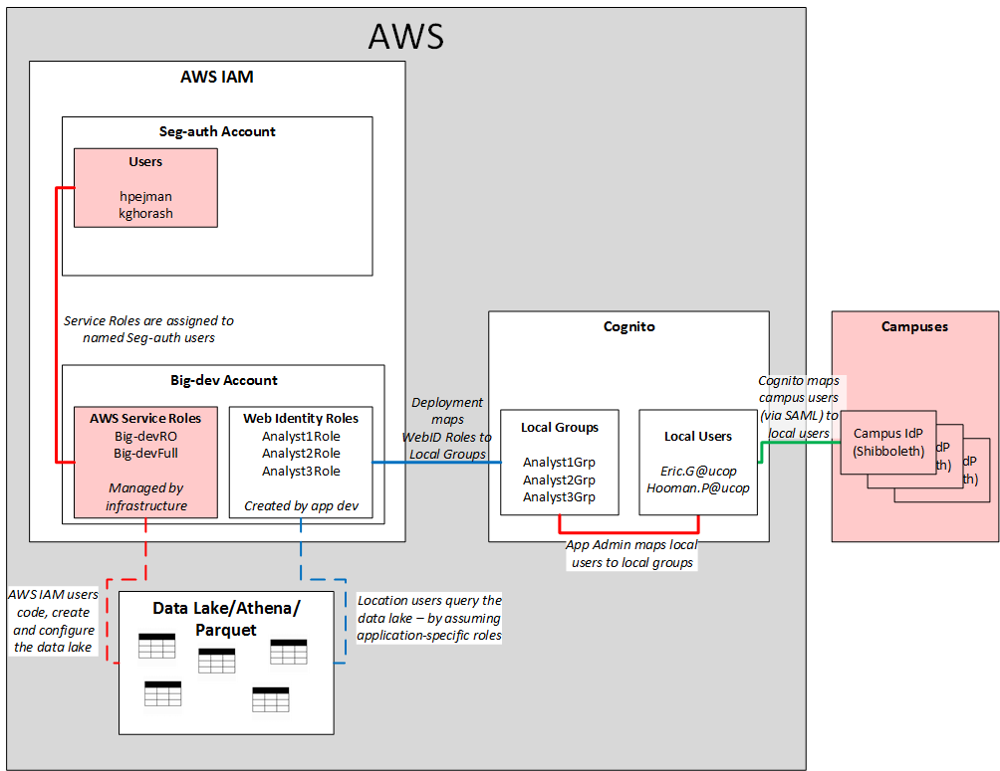

# Application Credential Vending via cognito federated identities.

English Translation: cognito as an identity and access router


## 9:00-9:05 Intro - Odell

One of the primary services UCOP provides to the broader UC is secure,
auditable, reliable and affordable access to data. We're going to show one way
to control client access to a data set. Please hold your questions til the end.

## 9:05-9:10 Goodman - IAM architecture

* High level architecture and design choices



* More detailed discussion describing solution in detail may follow depending on demand...

## 9:10-9:15 Odell - app/auth roles and responsibilities

Here's the general idea that governs data access via token vending:

### IAM Web identity roles are created with named exports, eg:

  * sdapDevLevel1AnalystRoleArn
  * sdapDevLevel2AnalystRoleArn
  * sdapDevLevel3AnalystRoleArn

These are special roles only assumable by a specific cognito Identity:

```
    const webIdPrincipal = new iam.WebIdentityPrincipal(
      "cognito-identity.amazonaws.com",
    ).withConditions({
      StringEquals: {
        "cognito-identity.amazonaws.com:aud": account!.cognitoId,
      },
    });
```

where the value of cognitoId is a specific cognito Identity, ie:

```
      "cognitoId": "us-west-2:e3326ef3-911e-4911-a586-ddaf846b8f38",
```

### Data steward determine the correct set of policies/permissions

By creating explicit grants to resources for the named web identities.

### Cognito User Pool groups.

IAM Web identity roles are used in the authentication stack to create one and
only one Cognito User Pool group per web identity role, eg:

```
aws cognito-idp list-groups --user-pool-id us-west-2_9Ts1Uy4qC |jq -r '.Groups[].GroupName' |grep Analyst
SdapDevAnalyst1
SdapDevAnalyst2
SdapDevAnalyst3
```

User pool groups are then administered (by whom?!) to include the correct set of users.
Once a user is added to a group they will then be able to access sts tokens
based on the web identity role's permissions and policy.

### Sequence of events in generic 

### Specific Clients

* [athenacli](https://github.com/ucopacme/amazon-cognito-cdk-example-for-getting-aws-credentials/blob/dev/docs/athenacli.md)
* Cognos
* DbVisualiser
* Denodo
* [Excel](https://github.com/ucopacme/amazon-cognito-cdk-example-for-getting-aws-credentials/blob/dev/docs/excel.md)
* Quicksight
* Tableau
* Others TBD...

## 9:15-9:20 Hooman - data access using sts tokens

* analyst access schema


* athena demo

## 9:20-9:25 Koorosh - excel access demo

* how to use sts tokens in excel

## 9:25-9:30 Food Fight, where to next
